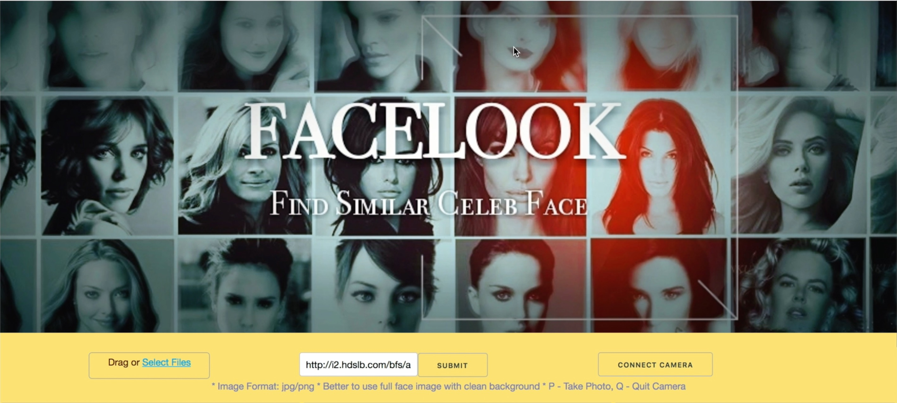

#Find Your Celebrity Match <hr>
+ This is a modified version of the [team project](https://github.com/TZstatsADS/Spring2018-Project5-grp3)
+ App Name: **Facelook**
+ Presentation Slide and Vedio Introduction: [https://prezi.com/qdc1ljheqp93/](https://prezi.com/qdc1ljheqp93/)
+ Team members
   +  Guo, Du <dg2999@columbia.edu>
   +  Guo, Tao <tg2620@columbia.edu>
   +  Jiang, Yiran <yj2462@columbia.edu>
   +  Liu, Fangbing <fl2476@columbia.edu>
   +  Wang, Jingyi <jw3592@columbia.edu>

## Project Summary
This is a Python Dash face recognition web application designed to find people thier celebrity match and to predict some attributes of their faces.  The app manages to find the images of the celebrities that people resemble the most along with similarity level. Attributes tab  predicts some attributes of people's faces such as face shape, attractiveness, and gender.

## Images
***<p align="center">The Cover of our Web page</p>***
  <br>
  
***<p align="center">Similarity for Jack Ma</p>***
  <br>
  
  
 ***<p align="center">Attributes for Jack Ma</p>***
  <br>
  
## Installation guide

+ Download the NPY file [`feature.npy`](https://drive.google.com/file/d/1iIwBS4Uq-X6a1Nl9MrWz7UAiugq6hDhu/view?usp=sharing) and put under `data`.
+ Download the CelebA dataset [img_ align_celeba.zip](https://www.dropbox.com/sh/8oqt9vytwxb3s4r/AAB06FXaQRUNtjW9ntaoPGvCa?dl=0) and put them under `data`. 
+ Run the [`app.py`](doc/app.py) file in the terminal.

## Method
 
1. Use Tensorflow as a pre-trained model to extract feature of over two hundred thousand images as a matrix of 512 columns and designing algorithm to handle the extraction of feature from new test image. 
2. Improve the face detect algorithm provided by OpenCV to better fit our data set. 
3. Use cosine similarity for the image matching and the corresponding similarity. 
4. Use Logistics model to train and predict for sex, attractiveness and face shape (We also try the SVM model, with the similar error rate as logistic. However, Logistic is faster and we obtain the estimated probability for each class). 
5. Build the dash page application, which start from scratch and implement all the function inside.
6. Three ways of importing of the test image. We manage to upload one's photo through the local file, source the image through the url address on the Internet, and implement the counnection with your own camera so that you can take a photo immediately and do the following matching and analysis. 

<!--***<p align="center">Error Rate for Logistic & SVM</p>***
  <br>-->


	
## Contribution statement : ([default](doc/a_note_on_contributions.md)) 

- Guo, Du: Using models trained by Tao Guo to make predictions. Constructed Attributes dash page to show the results of our predictions, and combined codes of other members. 
- Guo, Tao: Training part of the image for feature extracture. Building and training the Logistic Model for gender, attractiveness and face shape. Summary and Presentation with Yiran Jiang.
- Jiang, Yiran: Leader of the project. Collecting data. Improving and Running facenet CNN model for extracting features. Designing algorithm for cropping images. Running and evaluating SVM model on sex classification. Dash code and functions design. Dash Interactive and Logic design. Presentation.
- Liu, Fangbing: Designed python dash page, helped with processing data and organizing code.
- Wang, Jingyi:  Modified `README.md`; Designed camera connection, most part of the finding similar celebrity photo section, and python dash layout, and part of the image feature extracture process.

<br>
Following [suggestions](http://nicercode.github.io/blog/2013-04-05-projects/) by [RICH FITZJOHN](http://nicercode.github.io/about/#Team) (@richfitz). This folder is orgarnized as follows.

```
proj/
├── lib/
├── data/
├── doc/
├── figs/
└── output/
```

Please see each subfolder for a README file.
